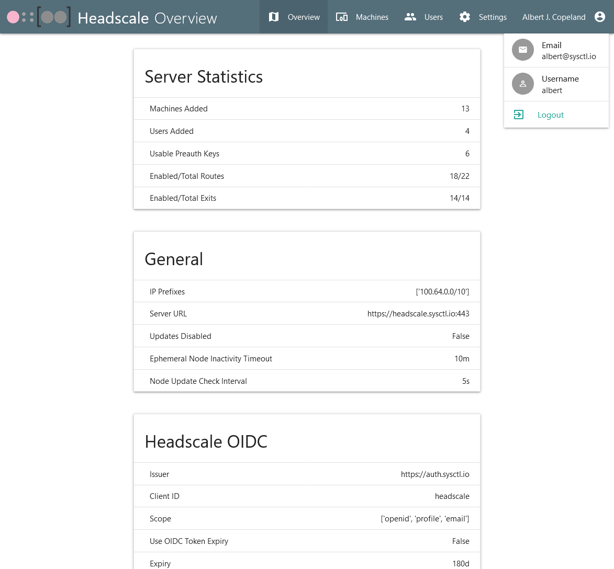
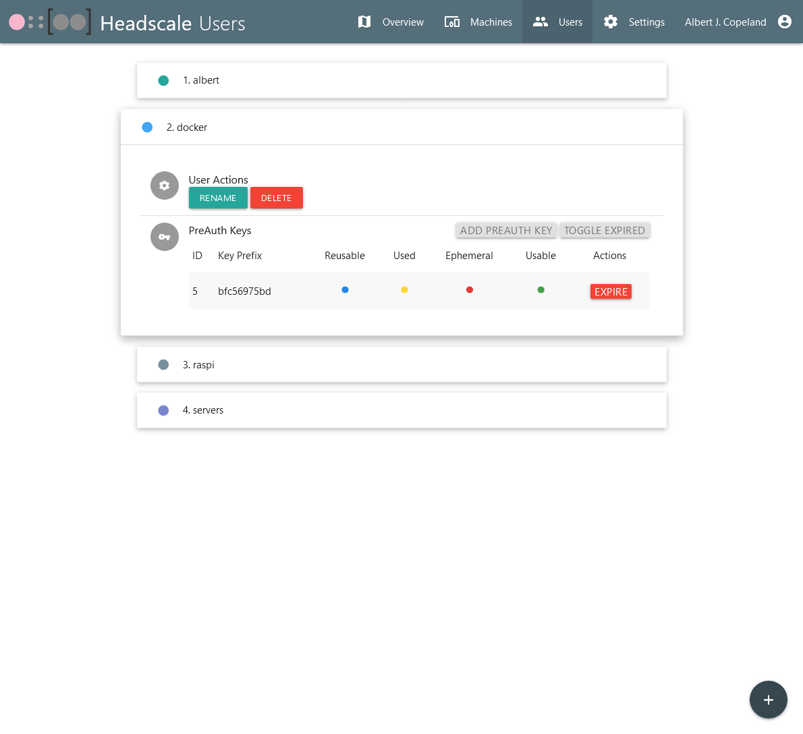
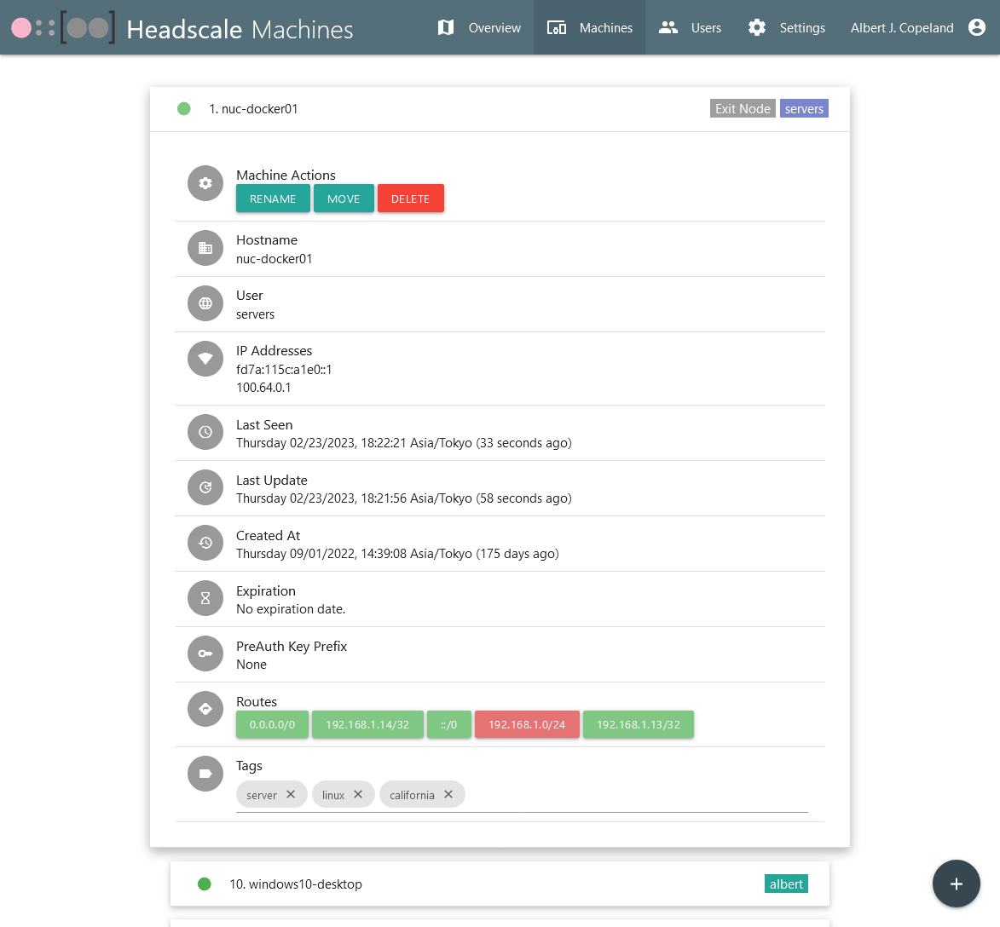
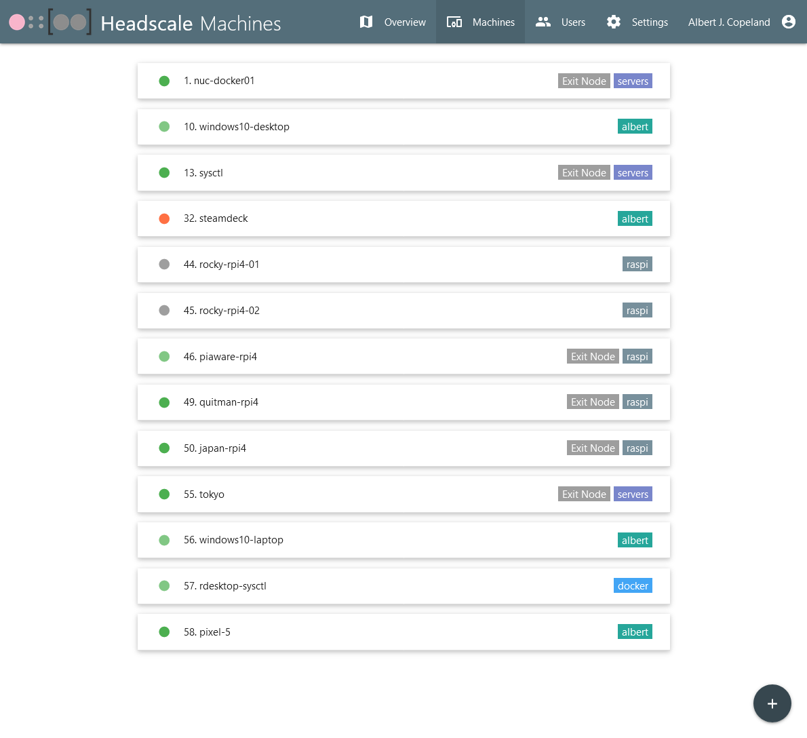
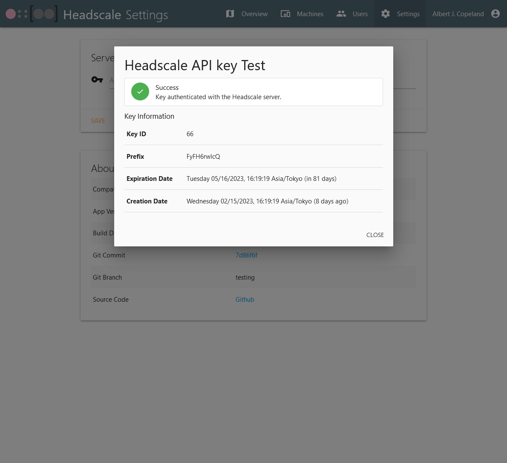

# headscale-webui
## This is a simple front-end for a Headscale server  
#### PR's, questions, bug-fixes, feature requests are welcome!
---
Allows you to do the following:
1.  Enable/Disable routes and exit nodes
2.  Add, move, rename, and remove machines
3.  Add and remove users/namespaces
4.  Add and expire PreAuth keys
5.  Add and remove machine tags
6.  View machine details
    * Hostname
    * User associated with the machine
    * IP addresses in the Tailnet
    * Last seen by the control server
    * Last update with the control server
    * Creation date
    * Expiration date (will also display a badge when nearing expiration)
    * PreAuth key associated with the machine
    * Enable / disable routes and exit nodes
    * Add and delete machine tags
7.  Basic and OIDC Authentication
    * OIDC Authentication tested with Authelia
8.  Change your color theme! See MaterializeCSS Documentation for Colors for examples.

---

# Installation:
## Docker Compose changes:
1.  Change the following variables in  (default values are shown):
```
- TZ=Asia/Tokyo                          # Change to your current timezone
# Use just the base color, ie "red" and not "red darken-3"
- COLOR=red                              # See MaterializeCSS Docs  for more colors.
- HS_SERVER=http://localhost      # Reachable endpoint for your Headscale server
- DOMAIN_NAME=http://localhost    # The base domain name for this container.
- SCRIPT_NAME=/                   # This is your applications base path (wsgi requires the name "SCRIPT_NAME")
- KEY=""                          # Generate with "openssl rand -base64 32" - used to encrypt your key on disk.
- AUTH_TYPE=oidc                  # AUTH_TYPE is either Basic or OIDC.  Empty for no authentication

# ENV for Basic Auth (Used only if AUTH_TYPE is "Basic").  Can be omitted if you aren't using Basic Auth
- BASIC_AUTH_USER=SomeUser        # Used for basic auth
- BASIC_AUTH_PASS=SomeSecretPass  # Used for basic auth

# ENV for OIDC (Used only if AUTH_TYPE is "OIDC").  Can be omitted if you aren't using OIDC
- OIDC_AUTH_URL=https://auth.$DOMAIN/.well-known/openid-configuration # URL for your OIDC issuer's well-known endpoint
- OIDC_CLIENT_ID=Headscale-WebUI    # Your OIDC Issuer's Client ID for Headscale-WebUI
- OIDC_CLIENT_SECRET=secret  # Your OIDC Issuer's Secret Key for Headscale-WebUI
```
2. You will also need to change the volumes:
    1.  /data - Where your encryption key will reside.  Can be anywhere writable by UID 1000
    2.  /etc/headscale/ - This is your Headscale configuration file.
3.  Make sure the host path for /data is readable and writable to UID 1000, otherwise writing the key to disk will fail.

## Traefik example with SSL:
* docker-compose labels:
```
    labels:
      # Traefik Configs
      - "traefik.enable=true"
      - "traefik.http.routers.headscale-webui.entrypoints=web-secure"
      - "traefik.http.routers.headscale-webui.rule=Host(`headscale.$DOMAIN`) && (PathPrefix(`/$BASE_PATH/`) || PathPrefix(`/$BASE_PATH`))"
      - "traefik.http.services.headscale-webui.loadbalancer.server.port=5000"
      - "traefik.http.routers.headscale-webui.tls.certresolver=letsencrypt"
```
* Replace $DOMAIN with your domain and update $BASE_PATH to your BASE_PATH.
* If you do not need SSL, remove the tls.certresolver=letsencrypt line


## Nginx example:
* Thanks to @qiangyt for their contributions!
* nginx reverse proxy config:
```
location /admin {
proxy_pass http://127.0.0.1:5000/admin;
proxy_http_version 1.1;
proxy_set_header Host $server_name;
proxy_buffering off;
proxy_set_header X-Real-IP $remote_addr;
proxy_set_header X-Forwarded-For $proxy_add_x_forwarded_for;
proxy_set_header X-Forwarded-Proto $http_x_forwarded_proto;

    auth_basic "Administrator's Area";
    auth_basic_user_file /etc/nginx/htpasswd;
}
```
* Remove auth_basic if you are using the built-in OIDC or BasicAuth

---
# Screenshots:
Overview Page:

Users Page:

Machine Information:

Machines Page:

Settings Page showing an API Key Test:


---
# Tech used:
* Python - 
* Poetry - 
* MaterializeCSS - 
* jQuery - 

For Python libraries, see 

If you use this project, please reach out!  It keeps me motivated!  Thank you!