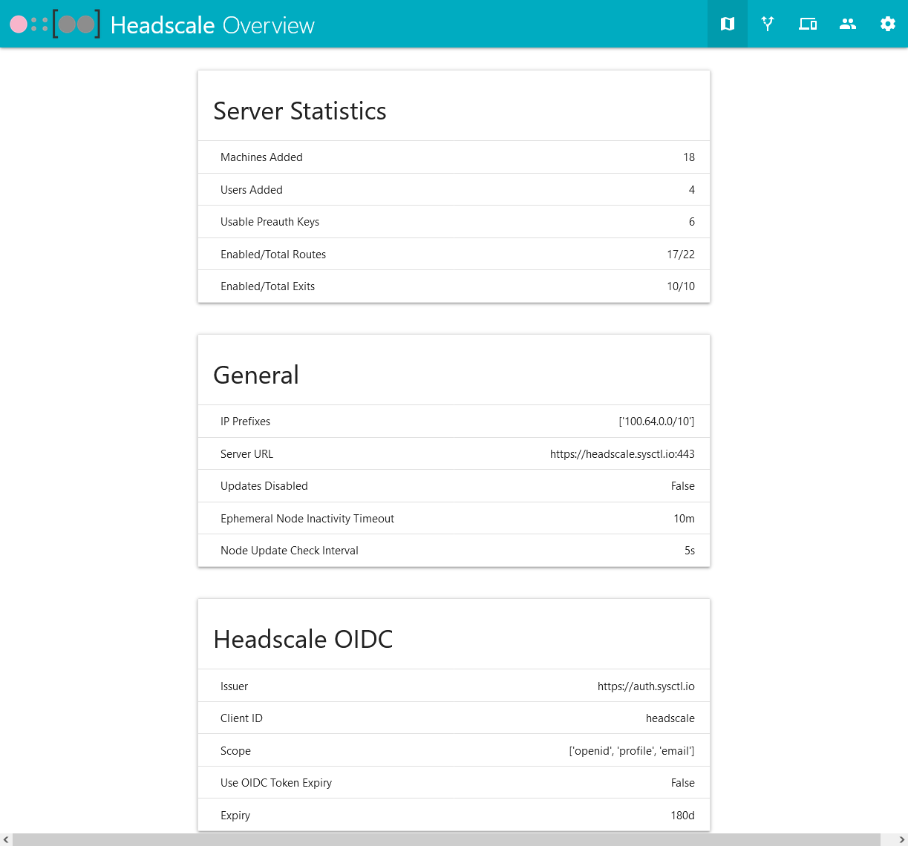
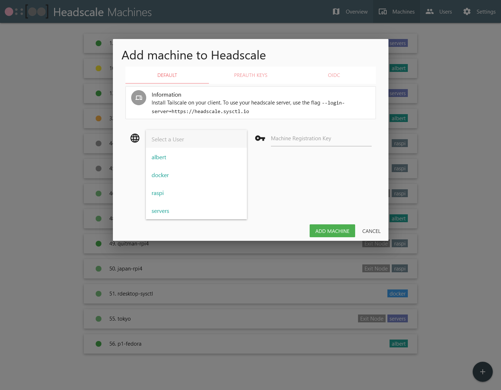

# headscale-webui
## This is a simple front-end for a Headscale server.  
#### PR's, questions, bug-fixes, feature requests are welcome!
---
Allows you to do the following:
1.  Enable/Disable routes and exit nodes
2.  Add, move, rename, and remove machines
3.  Add and remove users/namespaces
4.  Add and expire PreAuth keys
5.  Add and remove machine tags
6.  View machine details
    * Hostname
    * User associated with the machine
    * IP addresses in the Tailnet
    * Last seen by the control server
    * Last update with the control server
    * Creation date
    * PreAuth key associated with the machine
    * Enable / disable routes and exit nodes
    * Add and delete machine tags

---

# Installation:
## Docker Compose changes:
1.  Change the following variables in docker-compose.yml:
    1.  TZ - Change to your timezone.  Example: Asia/Tokyo
    2.  HS_SERVER - Change to your headscale's URL
    3.  BASE_PATH - This will be the path your server is served on.  Because the Windows Tailscale GUI expects <HS_SERVER/admin>, I usually put this as "/admin"
    4.  KEY - Your encryption key to store your headscale API key on disk.  Generate a new one with "openssl rand -base64 32".  Do not forget the quotations around the key when entering.
2. You will also need to change the volumes:
    1.  /data - Where your encryption key will reside.  Can be anywhere
    2.  /etc/headscale/ - This is your Headscale configuration file.
3.  Update the build context location to the directory with the Dockerfile.
    1.  Example:  If Dockerfile is in /home/username/headscale-webui, your context will be:
        * context: /home/username/headscale-webui/

## Traefik example with SSL:
* docker-compose labels:
```
    labels:
      # Traefik Configs
      - "traefik.enable=true"
      - "traefik.http.routers.headscale-webui.entrypoints=web-secure"
      - "traefik.http.routers.headscale-webui.rule=Host(`headscale.$DOMAIN`) && (PathPrefix(`/$BASE_PATH/`) || PathPrefix(`/$BASE_PATH`))"
      - "traefik.http.services.headscale-webui.loadbalancer.server.port=5000"
      - "traefik.http.routers.headscale-webui.tls.certresolver=letsencrypt"
```
* Replace $DOMAIN with your domain and update $BASE_PATH to your BASE_PATH.
* If you do not need SSL, remove the tls.certresolver=letsencrypt line


## Nginx example:
* Thanks to @qiangyt for their contributions!
* nginx reverse proxy config:
```
location /admin {
proxy_pass http://127.0.0.1:5000/admin;
proxy_http_version 1.1;
proxy_set_header Host $server_name;
proxy_buffering off;
proxy_set_header X-Real-IP $remote_addr;
proxy_set_header X-Forwarded-For $proxy_add_x_forwarded_for;
proxy_set_header X-Forwarded-Proto $http_x_forwarded_proto;

    auth_basic "Administrator's Area";
    auth_basic_user_file /etc/nginx/htpasswd;
}
```

---
# Screenshots:
Overview Page:

Users Page:

New Machine Modal:

Machines Page:

Settings Page showing an API Key Test:

