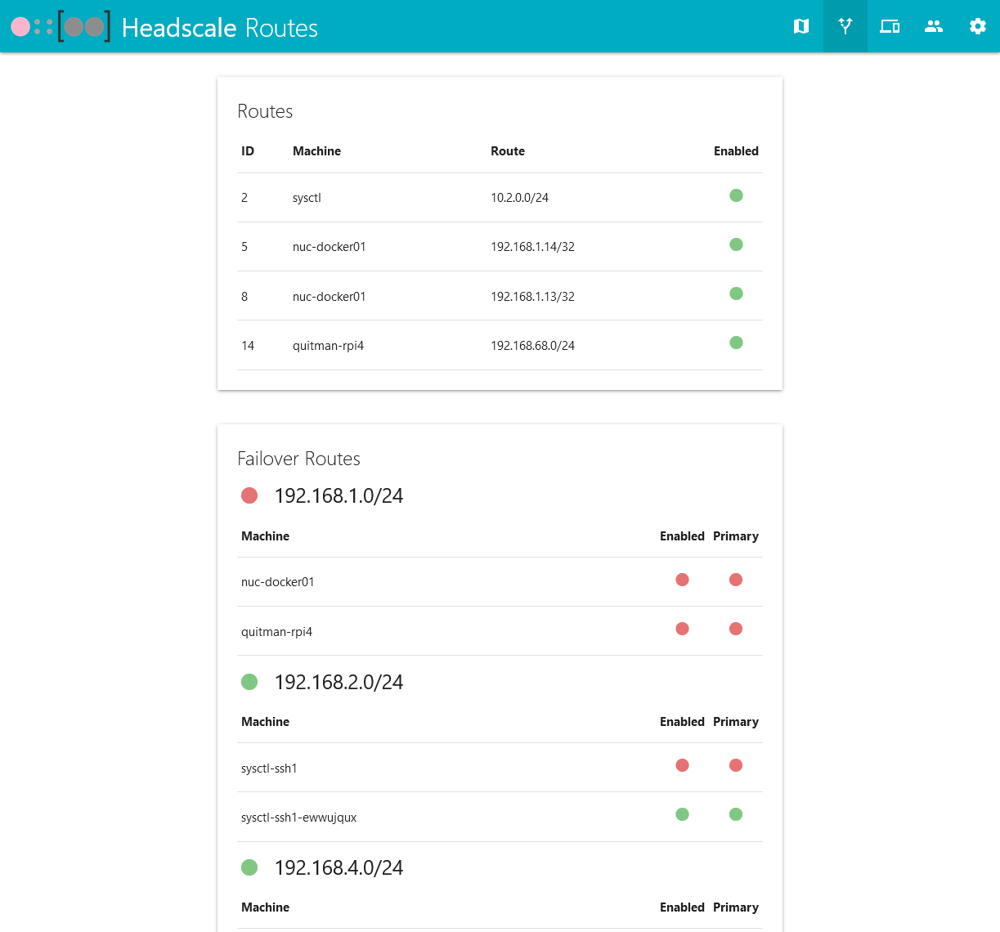

  

<h2 align="center">Headscale-WebUI</h3>

  A simple Headscale web UI for small-scale deployments.

  <a href="#Screenshots">Screenshots</a> | <a href="SETUP.md">Installation</a> | <a href="https://github.com/iFargle/headscale-webui/issues">Issues</a>

---
# Features
1.  Enable/Disable routes and exit nodes
    * Manage failover routes as well
2.  Add, move, rename, and remove machines
3.  Add and remove users/namespaces
4.  Add and expire PreAuth keys
5.  Add and remove machine tags
6.  View machine details
    * Hostname
    * User associated with the machine
    * IP addresses in the Tailnet
    * Last seen by the control server
    * Last update with the control server
    * Creation date
    * Expiration date (will also display a badge when nearing expiration)
    * PreAuth key associated with the machine
    * Enable / disable routes and exit nodes
    * Add and delete machine tags
7.  Basic and OIDC Authentication
    -   OIDC Authentication tested with AzureAD, Authelia and Keycloak
        -   AzureAD needs OIDC_CLOCK_SKEW set to 360
8.  Change your color theme! See MaterializeCSS Documentation for Colors for examples.
9.  Search your machines and users.
    * Machines have tags you can use to filter search:
        * `tag:tagname` Searches only for specific tags
        * `machine:machine-name` Searches only for specific machines
        * `user:user-name` Searches only for specific users

---
# Installation
* See [SETUP.md](SETUP.md) for installation and configuration instructions.

---
# Screenshots:

---
# Tech used:
* Python - [Link](https://www.python.org/)
* Poetry - [Link](https://python-poetry.org/)
* MaterializeCSS - [Link](https://github.com/Dogfalo/materialize)
* jQuery - [Link](https://jquery.com/)

For Python libraries, see [pyproject.toml](pyproject.toml)

If you use this project, please reach out!  It keeps me motivated!  Thank you!
